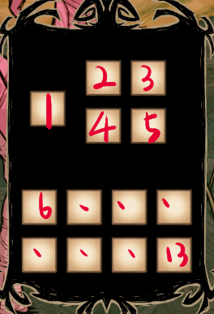

## 基本建筑介绍
* 具现原理：用于解锁Arc专属月亮科技
* 魔术宝石冰箱：可以永久保鲜
* 旅行者时空箱：一个可以随身携带和放置的箱子，不占背包栏，可以同步存储物品
* 宝石魔术灯：只是一个永久光源(目前)
* 腐败滋生术式：20倍加速腐败
* 第二分解术式：
分解一些指定的饰品，宝石，杂物
* Infinitas箱：清除垃圾
* 空间锚定塔：消耗活力，快速穿梭
* 魔术炮塔：高防重炮
* 饰品作坊：作用同名
* 炼金台：合成各种基本材料
* 宝石发生器：
操作界面如下：  
</img>  
有两个燃料条：暗影条，月化条(200%)   
在第二，三个格子填入燃料，它们可以是：纯粹恐惧，噩梦燃料，月亮水晶，月质   
注：不要把燃料放在第三格，因为一个不知到怎么修的小bug导致任何东西都可以放入第三格  
可以在第一个格子置入【十二面骰子】(激活后)可以让两条数值翻转  
在第一个格子放置石质消耗品，它们可以是：大理石，岩石，燧石，硝石，金块，冰块  
机制：  
(暗影条+月化条)>60% 开始产出普通宝石  
暗影条>月化条 产出红蓝宝石 + 稀有宝石（7%）  
暗影条50%>+月化条>70% 产出宝石碎片(20%) 宝石块（10%）  

* 映月台：  
在上方的格子放入岩石和燧石，在有月的夜晚会这些材料会逐渐妆化为月岩
