# 浅谈汉化入门基本思路与实操
## L1
前言：
本贴介绍如何程序上汉化一个gal的标准流程，适用于有一定正向开发能力（其实也不一定要有），但是**完全没有逆向经验**的人来汉化自己想要的游戏。  

先介绍一下我自己的情况：一个接近毕业的，经历过标准教育的，根正苗红的计算机系的大学生。  
你可以自己评估一下，如果是类似的情况，那么游戏汉化对你来说是很容易（指花1-3天即可）“上手”（指有能力在查阅资料后汉化大部分游戏，但非真会）的，此贴对你而言应该相当舒适。  

如果你不是相关专业的同学，你可以根据后面的内容自己评估一下适不适合，如果我说的概念都能看理解，那么你也很适合自己动手来做。  

我会从必须要知道的一些基本概念开始入手，到使用的基本工具链的介绍和使用，再到讲解通用汉化流程，从集中到在两个我动手做过的真实汉化案例（一个简单，一个难度较高）中穿插介绍。  

毕竟在这个赛博年代，ai让翻译资源有开始free的倾向，我认为但不少人应该是缺乏程序能力，本贴旨在提高社区能动性，丰富社区资源，你要是真会了干点什么以后我自己找汉化也容易点。  

这篇贴如果能写完会非常长，预计会有1w字左右，看看今天能不能写完。  
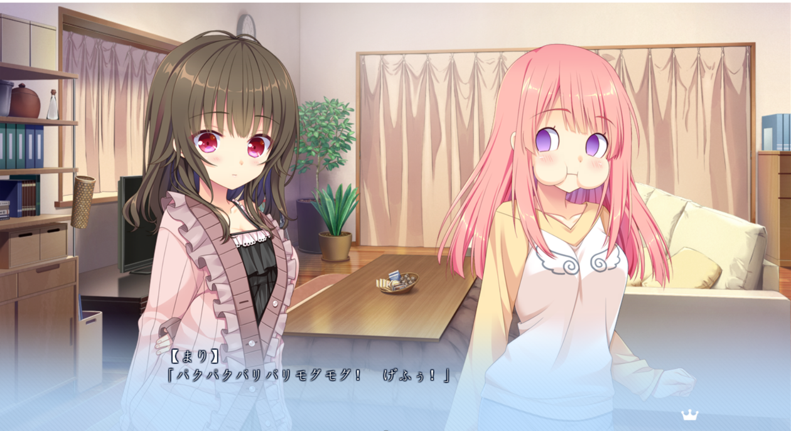

## L2
首先你要知道的概念：  
【编码标准】搞汉化就是在和字打交道，理解编码肯定是最重要的。
所谓的的编码标准就是一套从【字符空间】（类似{a，b，c...}人脑中的印象的符号集合）到【编码空间】（类似{0A0D，0BCD，...}这样的数字序列的集合）的映射。  

我们汉化中最常接触到的编码标只有3种:
GBK（也叫CP936）, 
shift-jis(也叫CP932) ,
utf8   
你只要知道，我们在汉化的时候一般是：从shiftjis修改到GBK，这是由于
1. shift-jis和GBK都是一个字符双字节（45AB这样）为主  
2. GBK完全支持日文日文字符  

这样的特性决定的。 

我简单介绍一下这些编码的特性和来源（*）：  
utf-8是一套unicode的实现方案，前面说的，编码标准是【字符空间】→【编码空间】的映射，uft8其实不同，它是【unicode编码空间】→【编码空间】的映射。  

【unicode编码空间】是对【字符空间】的机械定义，也就是【字符空间】→【unicode编码空间】。  
因为你难说清楚人类有多少符号，所以有了Unicode，人类已知的通用符号有哪些，人的认知的边界在哪里，都由unicode来定义（unicode甚至包括什么emoji🦄，什么楔形文字𒀝，尼鲁字母ᚠ云云）。  

实现了所有unicode字符的编码我们称之为【支持Unicode】，所有utf-x都是实现了unicode的【编码标准】,其中utf-16，utf-32并不是说数字越大越先进的编码，而是单个字符的占用空间越大，解析速度越快的编码。  

有些人分不清GB2312，GB18030，GBK的区别，这三者编码都是中国国家标准指定的，它们的定制上的先后顺序是  
GB2312（1980）→GBK（1993）→GB18030（2000）  
后者完全兼容前者的递进关系,并且支持的字符越来越多。  

GB18030开始支持unicode，常用字符而且几乎定长性能友好，所以我们是相当国际化的(滑稽)。

## L3
【数据包】你应该发现过有很多文件，当你双击打开时你会发现它们“点不开”，比如.tex文件，.dll文件，.dat文件云云...  

现在你应该转变观念，一个文件“能点开”才是特殊的，不能点开才是正常的。  

实际上，任何文件（即使是txt）都需要有专门的程序来负责“解析”，一个不能解析的文件就是一堆没用的数字，在硬盘里除了占位置没有任何意义，操作系统就是一个大软件，它帮你完成了解析exe以及关联文件和他的解析程序的工作。  

任何文件，包括txt，exe，dll，html，png，jpg,你都可以叫他它数据包（当然我就随口一说你别真和别人这么叫）。

如果文件的解析程序是流行（指操作系统内置）的，那么我们把它称为【明文】数据包。如果文件需要一个不流行的程序用来解析，那么他就是一个一般数据包。

我们一般通过（一个或多个）明文文件来一般制作数据包，接下来我提到的【数据包】特指galgame.exe才可以解析。


那么我们为什么不把所有文件明文存储而要弄成数据包呢？主要原因是把可以让数据连续存储，减少跨块访问以提高IO性能（你可以发现拷贝多个小文件比拷贝同体积的一个大文件花的时间多的多），另外就是为了防你。

所以你会发现诶呀某些手游就更一个皮肤你要我更新3g，你可能会说你这皮是金做的还是铀做的，这就是由于游戏的包做的不好，它把你改的那个皮肤所在整个包给替换了，里面可能有其他没改过的皮肤也要下载。

## L4
【解包】：前面说过我们一般用明文来制作数据包，解包就是把数据包还原没加密过的明文文件的操作，比如你解压缩一个zip，其实就是在解包。

【封包】：顾名思义，把明文制成特定数据包的操作，比如你做一个zip就是一种封包行为。  
你可能会觉得，哎呀，知道怎么解包哪知道怎么封包不是轻轻松松。     
非也，你知道怎么算平方≠开方很容易，知道怎么算导数≠算积分很容易，知道怎么相乘≠因式（数）分解很容易，在只有解包算法的时候倒推出封包算法是极度困难的，我们需要使用IDA等工具静态分析出数据包的结构和加密算法，然后才能开发出封包软件。

【引擎】：如有你有游戏制作经验的话，想必对这个概念不陌生了，引擎本身就是一个【能跑的游戏】，制作游戏不过是在引擎上添加贴图，模型，UI，控制脚本，数据结构。  
你可以使用把相同引擎的的不同游戏视为相互的“换皮游戏”，所以如果一个游戏的引擎没有被更新或定制，那么汉化的流程几乎是相同的，我们汉化的主要工作，就是摸清（替换）封包文件数据中字符串和贴图的结构。

## L5
【程序位数】：32位程序是指使用32位指针，寻址空间为32位并使用32位指令集，寄存器集的程序。
最大的区别是你在写一个C程序的时候,比如：  
```C
int data = 3;
printf("%d", sizeof(&data));
```
32位程序输出4，64位输出8，处理数据和编译代码的时候要注意，一些解密程序编译成64位是跑不通。
32位程序要用x32dbg.exe调试，x64位程序要用x64dbg.exe来调试。  
那么怎么知道程序是64位还是32位的呢？很简单，你用x64dbg打开，底下出现：  
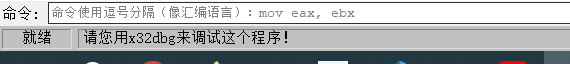
那么它就是32位程序。

【跟踪】：就是集中注意力观察程序的运行流程，具体操作是不停的打断点，步入（进），紧紧关注内存变化，寄存器变化，堆栈变化，解析出数据流动转化和控制逻辑，在跟踪过程中能观察出的信息和你的逆向水平直接正相关。  


 ## L6
需要使用的工具：  
【x64dbg】：这是“调试器”的一种，是逆向作业中最常用的工具，你可以使用“调试器”用来控制整个exe程序的运行流程。这个工具相比其他的上手有一些门槛，所以我画了一张图来介绍他的最基础布局，更具体的功能边做边提：  
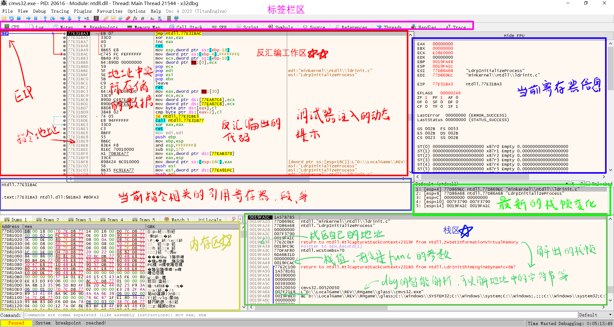
（这张图是我手画的，算比较有价值的一张，可以保存下来，不知道怎么上手看看它）    
注：汇编有AT&T风格语法和Intel语法，x64dbg反汇编的结果是Intel语法，查找资料的时候学习intel语法即可。  
EIP是指：Extended Instruction Pointer（扩展指令指针），是指示 CPU 当前正在执行或即将执行的指令的内存地址的一个寄存器，你可以视它为断点下将要执行的下一条指令的指示，所以你可以按ctrl+G，输入eip调整到当前正在运行的指令。  
【winHex】：二进制（Hex代表16进制）文件编辑查看工具的一种，你可以打开任意一个文件查看他的16进制存储数据，非常常用的编码转换编辑工具。    
【GRAbro】:最常用，好用的解包封包工具，实际上还有其他的，等有需要可以自己再找再用。  
【vscode】：一种文本编辑器，sublime什么的都可以（但用txt不行，上课用txt来讲代码的老师必然会渡过一个比较失败的人生）
以上四个工具是汉化用的最基础的工具，两个编辑器一个解析器一个调试器，每个类型的工具都有平替，我提到的是最标准的，如果你有自己的习惯，挑自己最趁手的就好。

## L7
好，说了一堆，接下来马上开始汉化实战第一款游戏，在此之前我先介绍一下汉化流程和误区：
汉化流程最主要的就三步：解包游戏,提取文本 -> 翻译文本，嵌回脚本 -> 封包游戏，修改exe，让游戏正常运行
了解这个步骤就能汉化游戏了。
汉化遵循着这样一个【原则】：冷门作品为了降本增笑，倾向于采用kirikiri之类的通用引擎，由于没什么钱，程序质量低，时常根本不加密，随便解包封包，然后就很容易汉化。
热门作品，有钱有实力，像柚子社那种可能会难点（我没焊过不知道,只是打个比方），但是自然有大佬出手，我不妨说的直白一点，根本轮不到你来焊。
所以，有一点实力，但是又不太热门的新作品，大概是（对你）最难的，最攻坚的汉化。    
是的，我要提到的误区是，有些人因为没有接触过汉化，总觉得汉化程序很难，实际上并不是，因为已经有大佬给你负重前行过了，汉化的难度是随引擎的不同而剧烈变化的，难度低的作品（占比还不少！），你【根本不需要知道怎么写代码怎么逆就能焊】，难度高的程序，我可以说没有任何人能100%保证可以逆出来，来个D加密就老实了，有一个算一个全部挺尸（但是D加密不太可能，只是说极端情况可以这样，我也没有听说过有D加密的gal）。  
接下来实战第一个是名叫 《Miel- 巨乳な友達の母を若い巨チンで寝取って孕ませハーレムを作る話》的作品：  
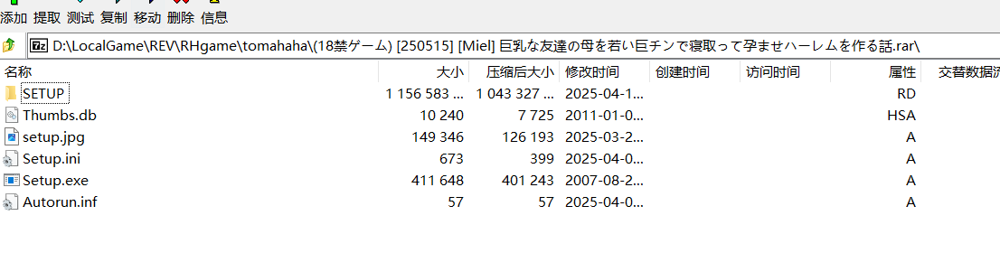
这是我在ggbase里随便（没有事先经过任何挑选）找的一个kirikiri类型的游戏，看起路子野野的游戏，根据上面的理论，这个应该很好焊。

## L8
注：其实如果是原镜像有不少是要区域认证和key的，但是解包的时候忘了在哪看到了crack str，好像是被人动过了，所以直接就能进入游戏，所以这步就演示不了。
第一步打开游戏观察一下：
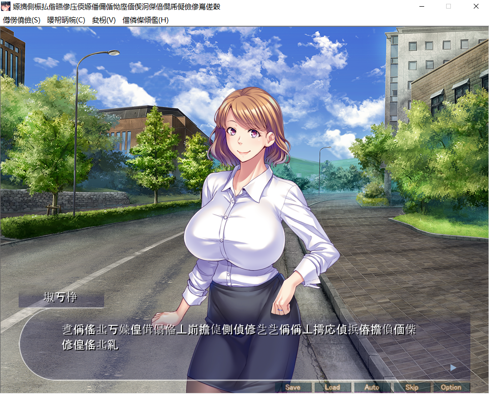
你观察到什么？游戏标题栏和游戏内文本同时乱码，乱成生僻字的形式，这对于汉化者而言，这太好了！至于好在哪里我马上解释，在此之前我来普及一个概念【转区】：
这个老玩家都懂，一个日文原版的游戏，如果有乱码，那么利用转区工具打开，乱码就会变成[可以看懂]的日文，用转区工具很简单，像这样把游戏拉到转区工具exe打开就行了：
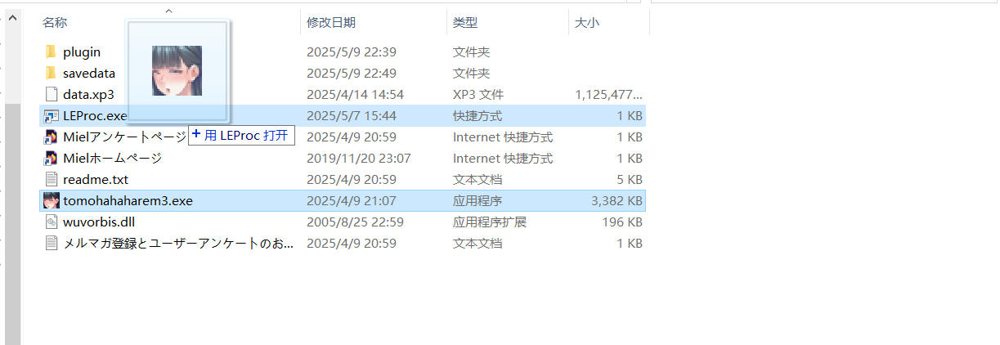
转区后会这样：
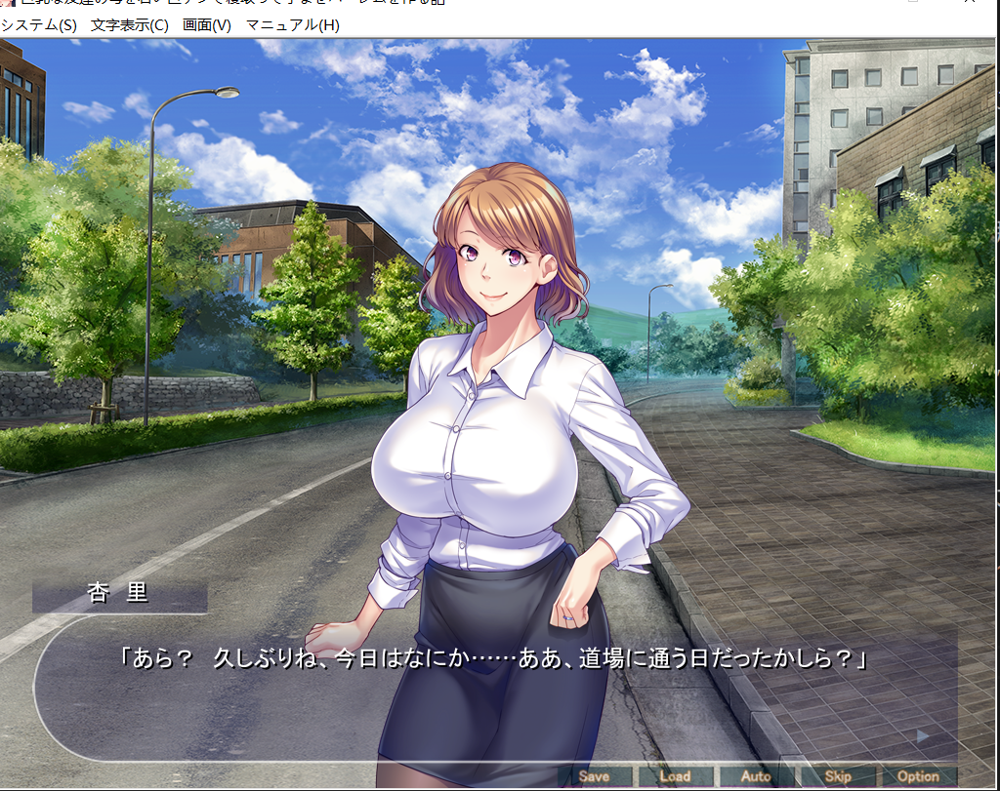
为什么转区有效呢？因为有不少程序员在存储字符串的时候没有指定编码，游戏引擎就默认调用当前计算机（就是你在安操作让你选择的那个中国）所处区域使用的编码来解码字符串，我们中国用的是GBK。  
但是，封包的时候这些字符串已经硬编码到了数据包中了，解包出来也还是shift-jis保存的字符串，游戏引擎管你这哪的，解包后直接把这些字符串对应的字符编码{82BB,82EA...}给gdi（一个操作系统库），然后告诉gdi这些数据编码是GBK，你给我渲染出来。  
然后gdi硬是以shift-jis的数据用gbk的方式解码，就解码出这些玩意了。  
转区，就是把系统地区设置为霓虹国，操作系统告诉游戏引擎，请用shift-jis解码，然后就正常解出日文了。

## L9
现在可以解释好在哪里了，没错，只要不转区，这个游戏内部是读取gbk编码的，这样我们就不用改exe中对应的编码方式和校验范围了。我们只要把游戏资源包中的日文字符串翻译成gbk对应的字符串即可其他的。
先观察目录结构，上下就这一个数据包data.xp3，显然我们想要的都在里面：
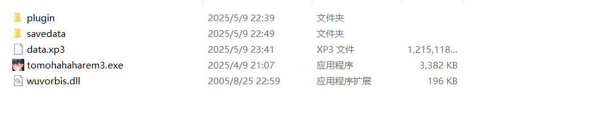  
现在我们开始解包，我是用的是（GARbro-Mod-1.0.1.6）这个对kirikiriz系列的作品特别好用：  
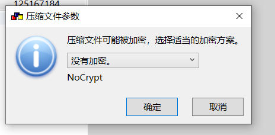
直接接进去了,打开scenario.ks：
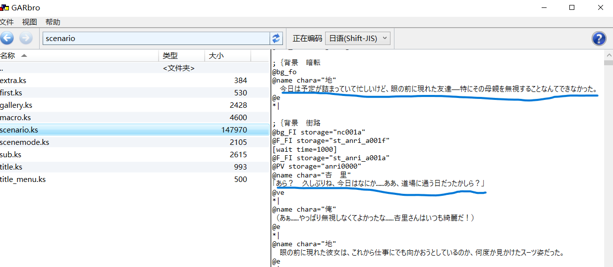 
发现所有游戏对话（包括控制代码）都在这个文件里，直接被拆拆包。  
我们修改一些对话（用GBK），以及游戏的第一张背景图片
vscode中点击圈出的这里来修改编码读取模式：  
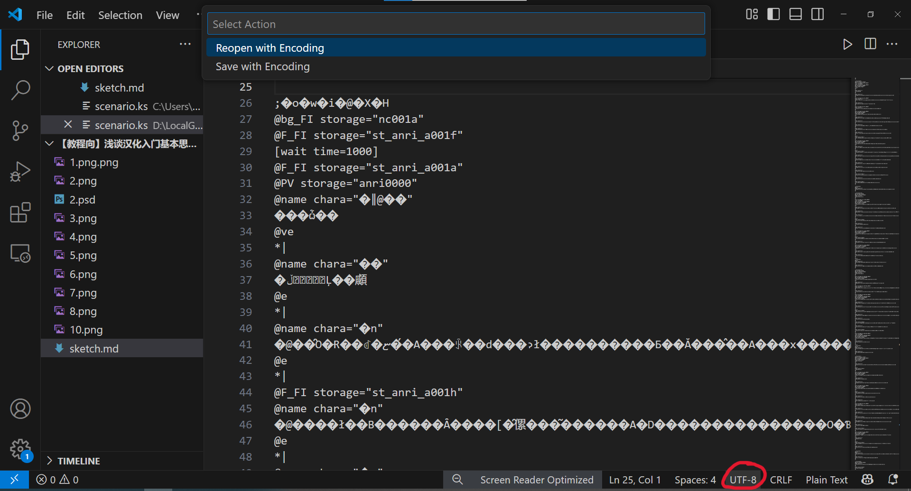 
用gbk把字符串文本修改后（其他的部分如非必要不要乱动）：  
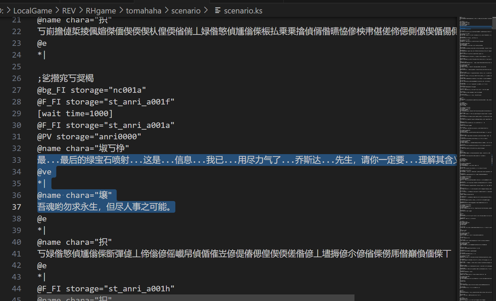   
用garbro封包，data.xp3文件覆盖原文件  
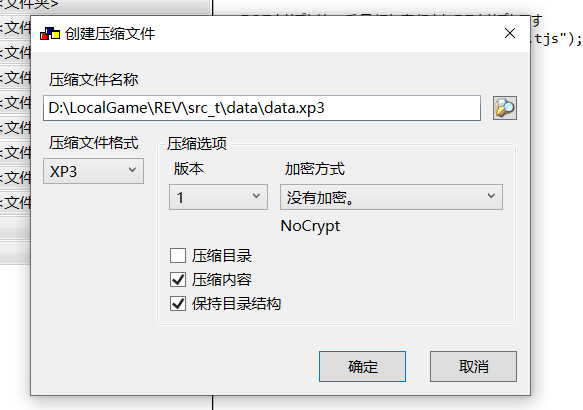   
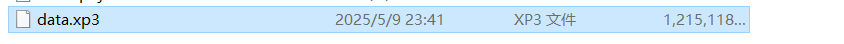   
再次进入游戏，发现：
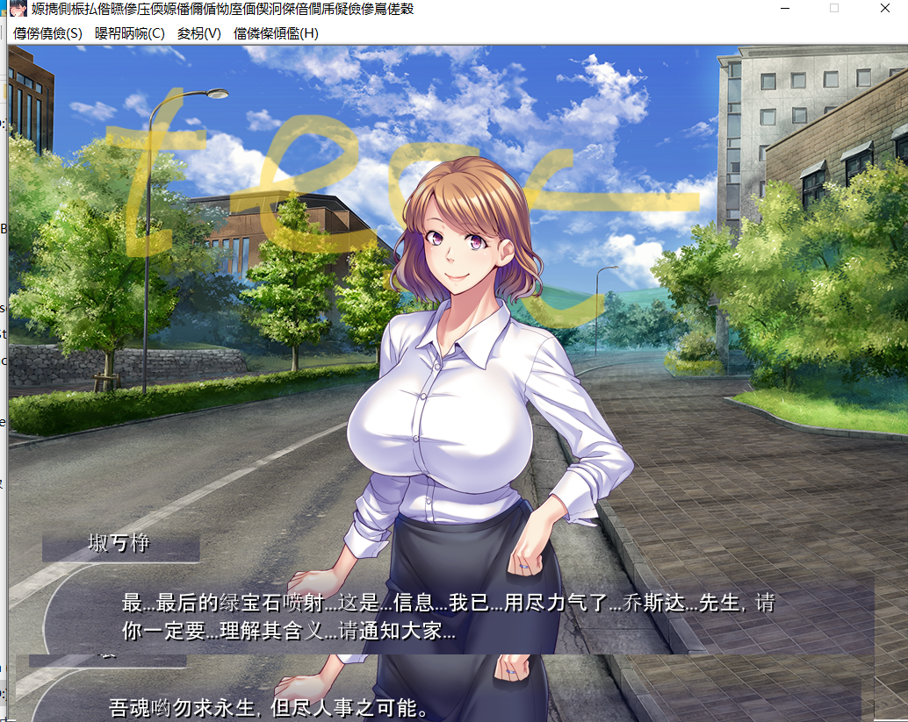 
至此，第一部游戏汉化成功，接下来就是修改哪些日文文本，ui图片，没有什么好说的，至少先不在这里说。
至于标题栏什么的，无论是去检索包里的title也好，还是用exe res hacker之类的手段把标题改掉，太简单了不在赘述。

## L10
看，我前面说的没错吧，如果你是新手，不要给自己很多压力，汉化起来都像这样非常简单的游戏数量是非常庞大，前面我没有写过一行代码，调试器，hex都没开就把游戏给焊了。
哦，当然不是所有游戏都这么简单的，二八定律嘛，接下来来看一个偏高难度的，你能独自把这个焊下来水平够焊90%+的游戏了：
这个游戏是purple社（就是写天津罪，青鸟的那个）的《青春フラジャイル》（玻璃青春），这个游戏因为脚本比较平所以热度一般，反正这个游戏是随便选的，因为我印象中是没有汉化组接过的，只有鸡饭，焊起来到不至于让人感觉是像在做无用功，所以会有趣点。
汉化思路参考了Hex-ray大佬的cmvs引擎分析，他讲的非常不错，他本人也是一个非常乐于分享的老玩家，比楼主大点，现在估计已经是一个社畜力
 

## L11
由于下载下来的镜像可以从exe直接进游戏，也不知到是有人帮我们动过了还是原本就不用验证，所以还是演示不了。  
我们先观察游戏目录（我精简了一下，删除了一些不必要的文件包括64位exe，32位比较好调）：  
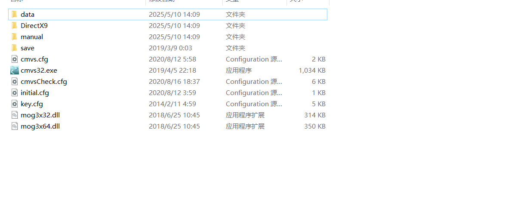 
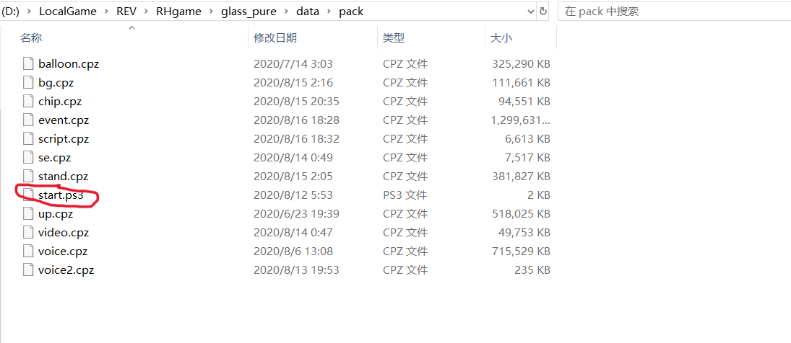  
发现游戏数据包中大多是这种.cpz文件结尾的包，通过这些你能得到什么信息？  
得到的信息就是：  
一 .cpz文件是purple社用的一个叫cmvs封包格式，所以我们要从这个引擎入手，看看能不能查到相关资料。
二 红圈圈出的地方有一个叫start.ps3的文件看起来与众不同，很有可能是脚本载入的程序的入口点。  
三 根据包的名字，我们要的文本资源有极大概率是在script.cpz这个数据包中，接下来我们可以重点解析这个数据包。  

关于【游戏引擎】：  
实际上，有不少游戏公司或同人没有自己独立的游戏引擎，这时候它们采用一些诸如kirikiri，unity之类的公开引擎来制作游戏，但是比较有规模的公司会采用自家研发的游戏引擎来制作，同一家公司不改引擎（几乎不改）和加密的话前后作分析起来【区别几乎是没有的】，市面上比较常见的引擎是屈指可数的（是比方，手指可能不够用！），我们可以通过封包格式判断游戏采用了什么引擎：  
KIRIKIRI系列 .xp3等后缀可以看出   
YU-RIS，.ypf后缀  
BGI .arc后缀  
Siglus .g00后缀  
Artemis .pfs后缀  
unity，看dll就知道太明显了  
还有我们这次分析的cmvs引擎 .cpz后缀  
...(上面列出的就差不多是业界的一半了，没遇到的自行查阅就好，很容易判断的，7788的魔改其实也不少就是了)  

## L12
再打开游戏看看：  
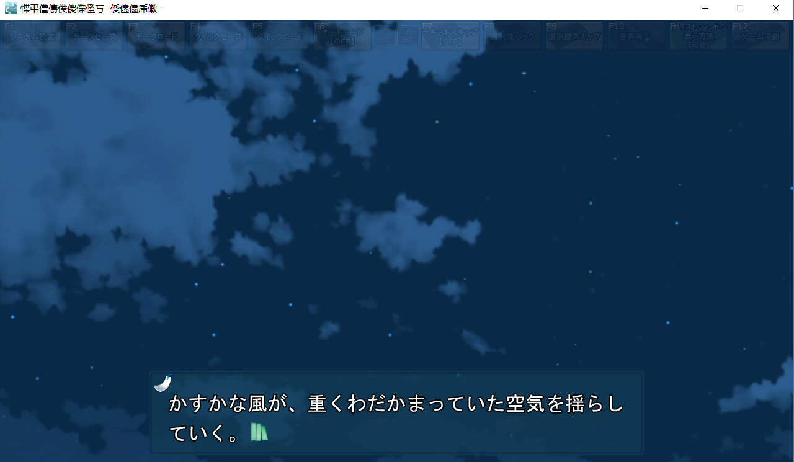  
发现标题乱码了，但是游戏内的文本可以正常显示，这说明：  
游戏内部虽然采用的是shift-jis编码，但是程序员显式指定了jis，所以一会我们要改成中文必须要把编码方式改成GBK，才能正确的识别我们的中文。  
然后我们试着用GARbro去解包script.cpz，发现可以解开：  
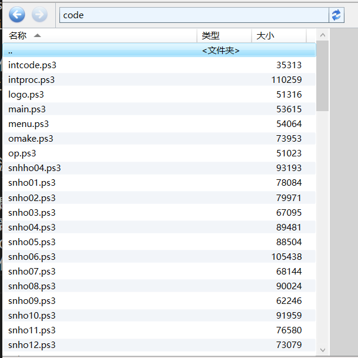   
实际上有大佬替你负重前行过了，我们直接进去就OK：  
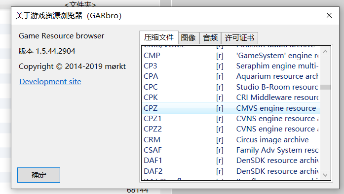   
解出来随便（并非）挑选一个包snky01.ps3,用【winHex】开进去看一下里面是什么样的：  
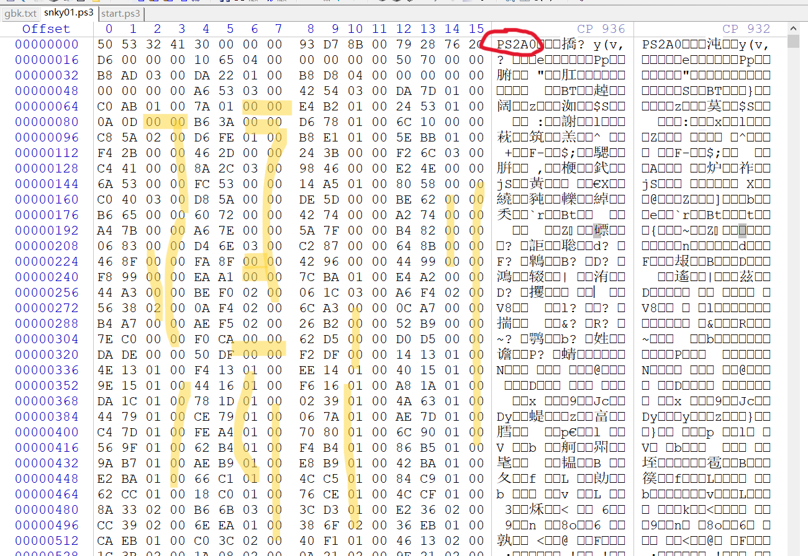  
多开几个包，你会发现，每个ps3文件前面都有这个"PS2A0"的这个头的特征，这个姑且记住一下。  
提示一下，你看到那些方框，你不要以为他是什么加密过的乱码，这其实是解密过（有GARbro的大佬给你负重前行过）的，你看我用黄色荧光笔标记的哪些数字，是不是00 01之类重复数据很多，学过信息论的都知道，真正加密压缩过的数据不可能这么稀疏，说明其实是解密过的数据，我为什么能那么刚好画出一整排的00 01？，这是因为它们有很多是固定长度的【机器指令】，它们的分格段被我划到了，所以我们甚至可以直接修改这些机器码来实现我们想要的一下逻辑。  
真正加密过的数据长什么样呢？其实前面提到的start.ps3就是加密过的，给你展示一下：  
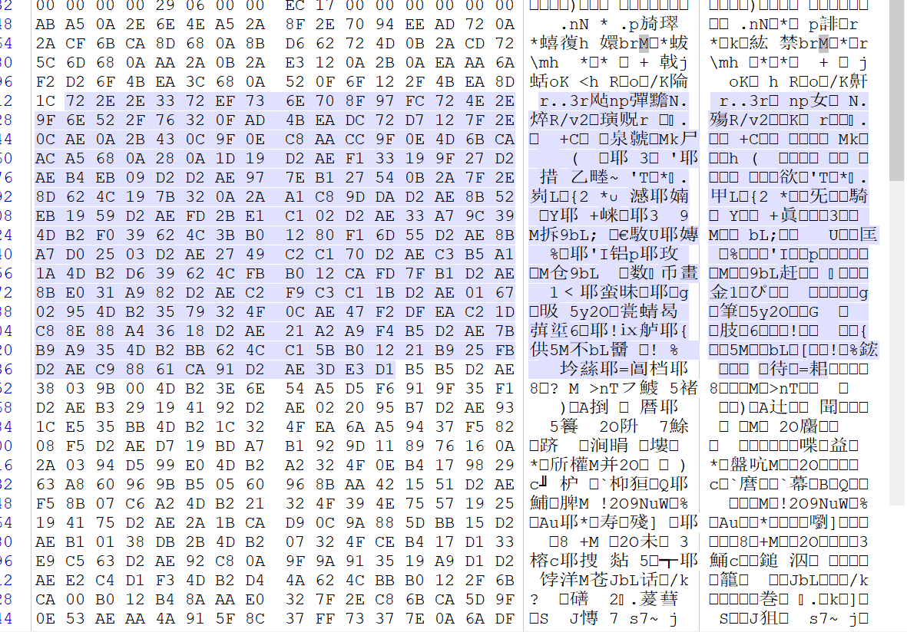   
能看出两者的区别了吧？所以我们把解密的snky01.ps3往下拉：  
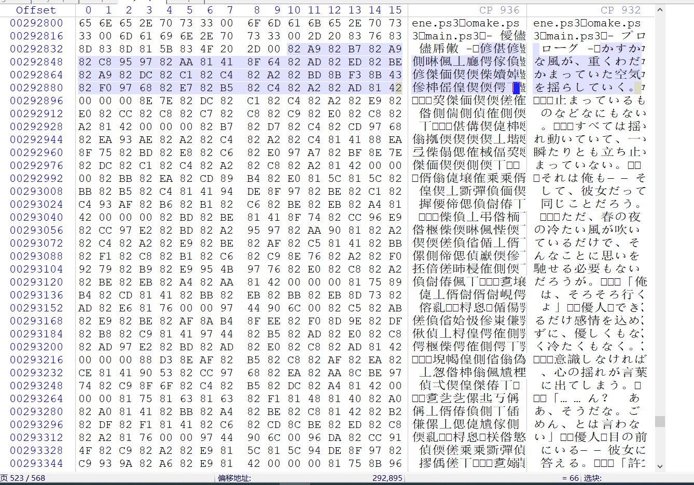  
标记出的这个是不是很熟悉？没错，这个就是前面进游戏截图的第一段话。  
而文件的名字叫：snky01.ps3  
还有snky02.ps3，snky03.ps3... snho01.ps3,snho02.ps3...  
显然我们可以猜出snkyxx代表的共通线，snho，snrz...代表的应该是对应的个人线脚本。  

OK，分析到这里，怎么搞大概可以有点想法了，就是用一些文本处理手段手段把汉化的文本弄到snkyxx.ps3,snhoxx.ps3里面去，然后再弄回.cpz就行了。

## L13
但是：
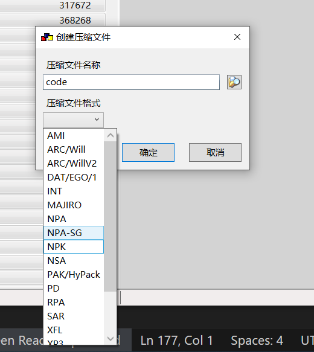    
可是Garbro并没有提供.cpz的封包，那么现在怎么把一堆.ps3文件弄回.cpz让exe读取呢？ 
这里提供3条路：  

0. 在github看看有没有现成的封包软件  
1. 用IDA集爆肝+烧脑为一体进行一次酣畅淋漓的静态分析，花几天甚至半个月，把整个封包结构摸透，然后自己写封包程序。
2. 用分析exe，HOOK等手段来【免封包】。

0我试过了，还真找到一个叫Niflheim有cpz的封包程序，但是编译运行下来不知道是我自己的原因（自由源码他也没给编译好的程序或makelist之类的），还是因为测试的封包是青鸟，反正《青春フラジャイル》是没法正常封包，你们要是有空可以去帮他给个issue，start之类，这种开发者还是欠issue，start的拷打。  
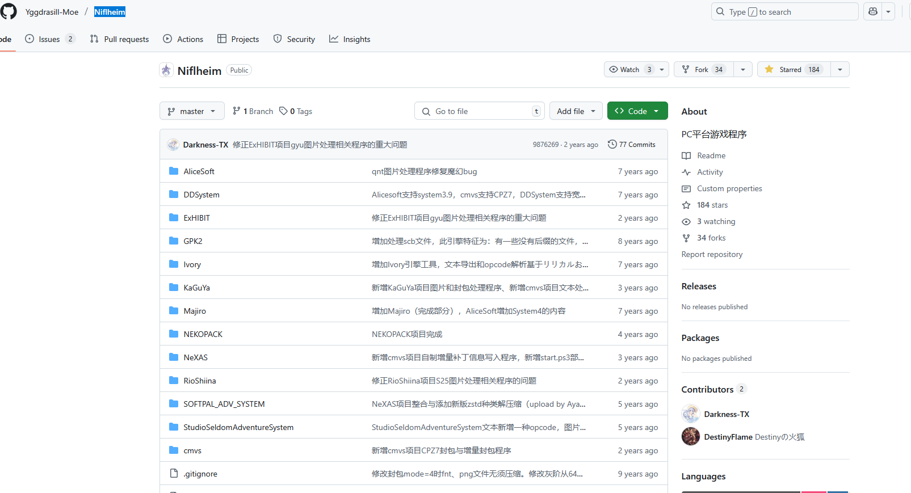    
1的话太难了，你我现在的水平弄起来很麻烦，再说能焊出来就行，弄的那么好也就图个好看，反正玩起来都一样，管他呢。  

所以这里用免封包手段来焊这个フラジャイル。  

【免封包】：由于游戏在运行期间是一定要把加密的数据包在内存中解密的成可以解析的文件的，免封包是指通过修改游戏运行流程，或劫持读取，解析函数等手段跳过数据包的解密流程，直接让游戏加载到我们修改过的解密文件，当你知道如何解密却不知道如何封包时，免封包是可以首先考虑的。  

## L14
首先我们用x32dbg打开游戏，在开始正式跟踪前我先教你一些基本操作，这里我要一些笔墨，请不要嫌麻烦，因为不会这些你什么都做不了：    
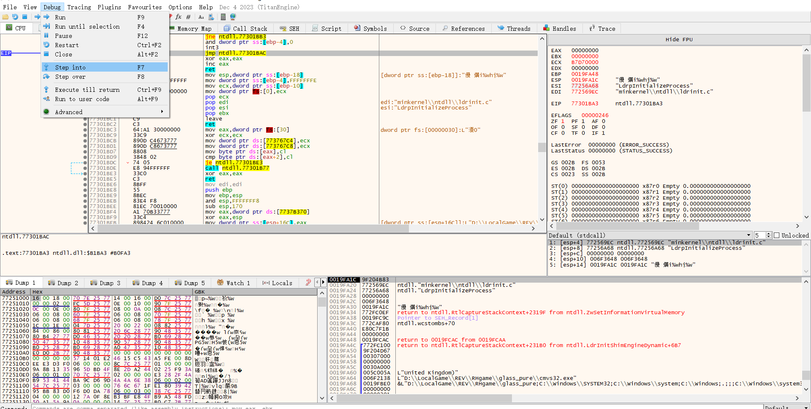    
F8：步过，单步执行，遇到call不会停。  
F7：步进，调试过代码的懂的都懂，就是你平时调试用的单步执行，和步过的**唯一区别**是，会引导你进入程序调用函数内部，比如你call abc，单步断会在abc子程序内部停下来，当你想查看调用函数具体怎么执行的，用步进F7就对了。  
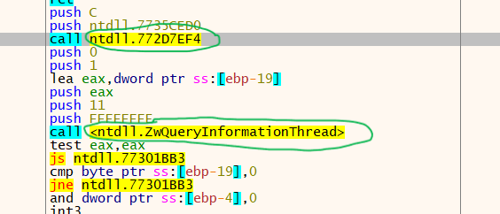    
用绿色笔圈出来的部分call ntdll.xxxx,其中ntdll叫模块名，xxxx是指模块call的函数在模块的偏移（offset）  

你可能以为ntdll是一个字母，但在计算机的视角下其实的ntdll是一个基地址0x??????  
call ntdll.772D7EF4 实际的含义是 call （0x??????+772D7EF4）这么一个地方。  

call <????>这种**带尖号**的是指被公开dll api库符号解析出的地址，含义和前面的一样，只是说明这个call调用的是一个对外public（写过代码的都知道什么是public吧？）的函数api。  

鼠标放在黄色标注的地方，按enter可以跳转到xxxx.xxxx指示的地址，dbg所有地方都遵循这个操作逻辑的。  
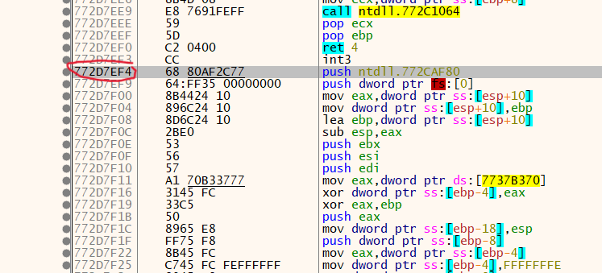    
按enter后，发现确实视角跳转到前面说的772D7EF4这个地方，然后字母跳回去呢？  
按-号视角跳回上一次查看的指令，按shift + ‘+’号调转到后一次查看的指令，就和网页跳转一样的路由逻辑。   
如果你跳的太深了，找不到当前运行的指令了，就按ctrl + G，然后输出eip就可以回到原处（这个就不放图了）。  

【模块】：我前面提到的ntdll.xxxx，说ntdll叫模块名，什么是模块呢？模块和一个一个可执行文件（.exe，.dll，.so）几乎就是一一对应的，比如这里的ntdll模块，就对应着ntdll.dll文件：  
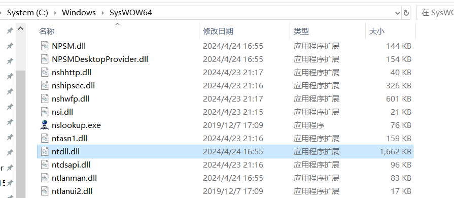   
模块最大的特征就是他有自己独立的内存段（*具体机理参考操作系统 内存映像），你在其他模块的页面的内存中是找不到你想要的数据的。  
另外，你在x64dbg的标题栏也就是红圈圈出的地方，可以查看当前程序流所处的模块。

## L15
在我们调试者(cracker)的眼中，当前运行的进程是这样的一个结构：
总进程process  
├── 你打开的exe（用户模块）  
│   ├── 一些公开的api0（symbol）  
│   └── ...  
├── user1.dll（用户模块，就是在游戏文件目录下的dll）  
│   ├── 一些公开的api1（symbol）  
│   ├── 一些公开的api2  
│   └── 一些公开的api3  
├── xxx1.dll（系统模块，就是C盘里的那些dll）  
│   ├── win32 api4  
│   ├── win32 api5  
│   └── win32 api6  
├── xxx2.dll  
├── xxx3.dll  
└── ...  

程序运行的流程就形如：  
start.exe运行一会（跳转到）→ api2处的函数 → api5处的函数 → 返回api2 → 返回start.exe运行一会 → 跳转到...  
不知道这样说你能否理解了？  

点击Symbol标签，你就可以清晰的（*有时候不一定）看到整个进程的所有资源结构：  
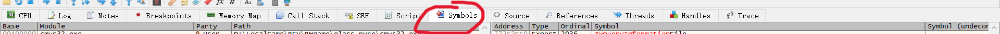
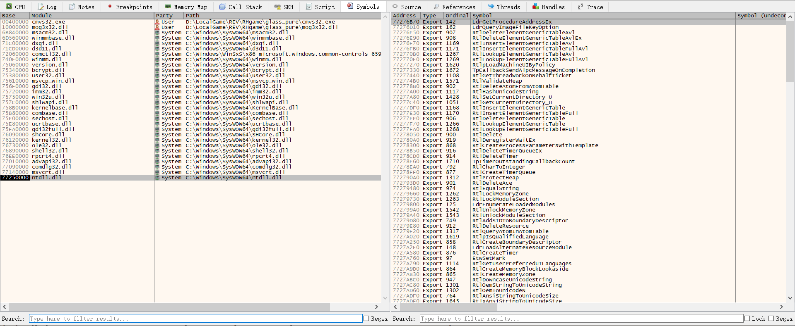 
这是当前打开进程中使用的所有模块和它们的API。  
比如前面的图【L11-2】绿色圈出的ZwInformationThread：  
你就可以在打开的Symbol中搜索到这个API，也是按enter可以跳过去，这里就不演示了：  
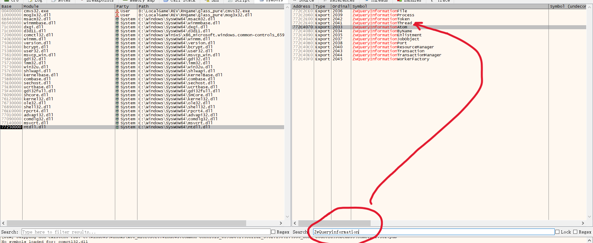

在搜索到的api上右键有一个toggle bp（切换断点），什么是断点我就不讲了，切换的含义就是把打开的断点变成关闭的，关闭的变成打开的。
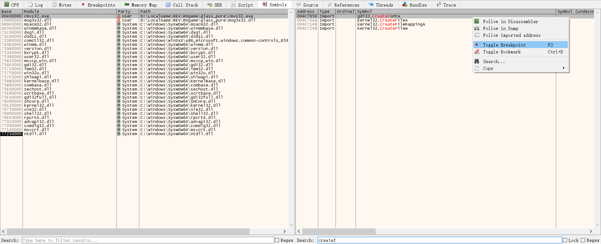  

先在回到CPU标签，你右键>search for>current moudle> constant >可以查找你当前打开页面的常量（这里的常量值汇编中的“立即数”）  
current moudle是模块中的所有内存段  
current rigion是在左下角打开的的内存区段  

这两个的区别，这个不太好解释(*涉及到进程的内存映像)，其实就是一个程序分为.data，.text等段，rigion查找的是当前打开的段（就是左下角）内存显示的那些（memory map标签中切换打开的内存段），反汇编编译的是.text段的，搜module就是在.data+.text+idata+...全部的段里搜，搜的结果会更多一点。
反正你用current moudle就对了。

注：
API是一个广义的名词，在当前上下文我们特指可以调用的“函数”。

前面提到的*有时候不一定是指：  
有些程序会加壳，所谓的壳就是一些保护进程不被调试的另外的程序。你理解为会让你看到的汇编代码变得乱七八糟无法难以跟踪难以理解就一种东西就对了。当你在symbols里面看不到什么东西import的时候，你就要意识到知道程序加壳了。  
这边推荐你别焊了直接跑路呢，遇到困难直接放弃，这需要真正有逆向经验的人来脱壳，你现在弄和大学生军训完直接上战场开战斗机没有区别，让逆向大佬来搞就好（当然也有简单的壳）。  

## L16
前面我说的有些东西你可能不太理解，比如什么虚拟内存,.data段什么，后面还会有一个知识点就是栈的结构，栈帧什么的概念，学计算机看到这些词的肯定都能懂，你可以在：  
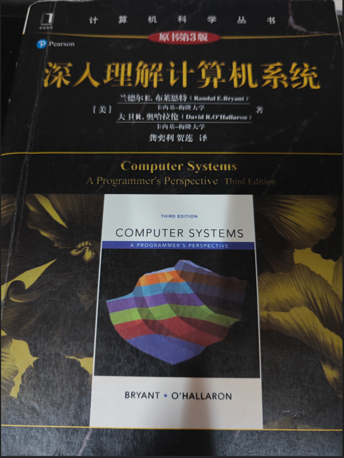  
里看到这些必要的知识：  
（虚拟内存映像）  
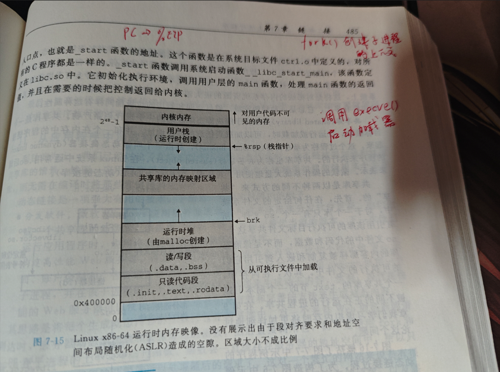    
（调用栈结构）  
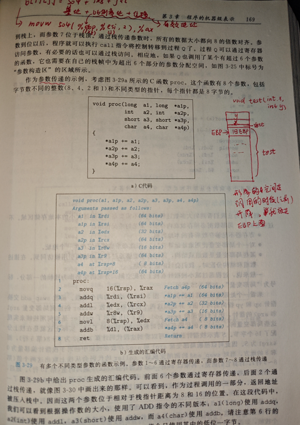    
学计算机的没事倒是可以看一看这本书，不是这个专业的就**别看了**（这种书我们都是已经会了80%的时候过一遍用来补体系的），我给你一些关键词，你用什么手段都好，花几个小时弄懂就行，看这书就是纯浪费时间：  
key1.操作系统 调用函数 栈  
key2.操作系统 进程结构 内存分配结构  
key3.汇编 Intel语法 寻址   

好啦好啦，一些必要的操作就先介绍到这里，你可能也看的有些烦了，但是不会这些就和不会呼吸不会走路无异，谈何跑过终点？接下来的跟踪思路我和你讲了你也吸收不到营养的，所以说希望你能理解。


## L17
这边纠正一个误区啊，有些人（特别是写过一些代码的）会有一种想法，觉得跟踪这个和平时调试源代码程序差不多，只要按f7跟住就行，不对啊这是不一样的，一直按f7跟不行的。  
先不说一点一点跟随便就要按几k次几w次f7你能不能受得了，如果你跨模块还很容易**跟丢**，你会发现eip卡住了之类的，你必须在你感兴趣的地方下断点才可以跟的住，能理解吗？知道要在哪里断要熟悉win32 api，这些老生常谈就不提了。  

前面（L11）说到我们怀疑start.ps3这个文件是程序的脚本载入的入口点，接下来我们要把视角想办法去跟踪这个start.ps3文件的载入，然后再单步调试，看看主程是怎么处理这个start.ps3的：  

介绍一个非常常用的win系统api：**CreateFileX**  
你想一下，我们要使用，读取一个文件之前，不管之后对它再怎么样，都要把磁盘上的文件load到内存里对吧？然后操作系统创建这个文件描述符df，然后...的，然后你的程序就可以通过文件管理系统读写这个文件嘛，最开始调用的就是CreateFile这个api。  

所以我们主程序模块（cmvs）上查找这个函数的调用，在createfileA上打断点：  
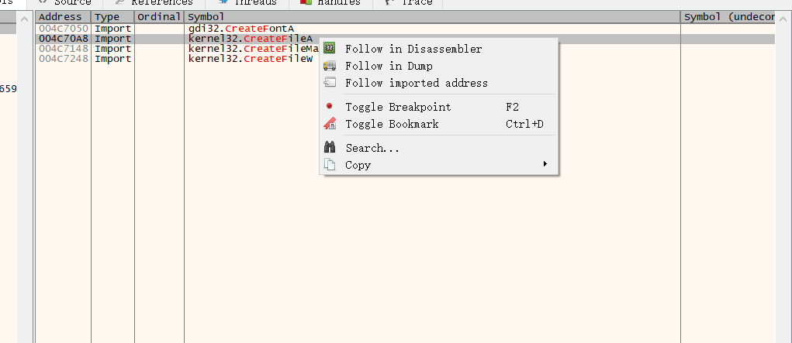    
你可以在这个标签管理你的所有断点：  
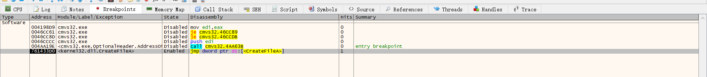    
为什么在createfileA上打而不在createfileW上打呢？  
因为CreateFileA是读取ASCII码作为函数参数的版本，CreateFileW中W是指宽字符，宽字符就是单字符占多字节的的字符，比如utf-16字符，很多什么软件不支持中文路径的罪魁祸首就是这种东西啊。  
反正我们把两个都试一遍，你会发现只有这个CreateFileA可以，接下来你按f9运行程序，死死盯住栈区（记住这些栈主要是和函数调用有关就行）：  
看到这里调用读取了一个info.txt，我可以事先告诉你这个没用，但是你自己逆的时候要社区看看这个info.txt是什么啊。  
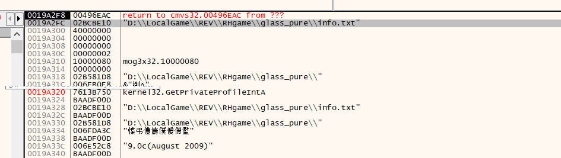   
好，忽视那些断出的明显没什么用的系统文件，终于在我们兴趣的地方断下来了，确实是通过这个文件开始载入的：  
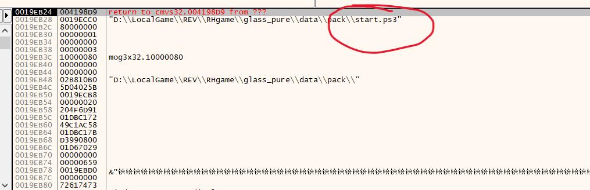   
现在我们处于调用入口，我们把鼠标放在cmvs32.004198d9那个地方看看是什么地方在调用这个start.ps3：
为什么要回去看？为什如果是你写程序，你打开了一个文件，这个文件是加密的，你接下来马上要做什么？
解密。
解到什么地方？
内存。
所以我们跟踪他调用它的这个地方，跟一会大概率马上就从内存里能获取到解密后(你也可以通过这个过程分析出.ps3的解密算法)的start.ps3。

## L18
跟过区发现这个地方在调用createfileA：
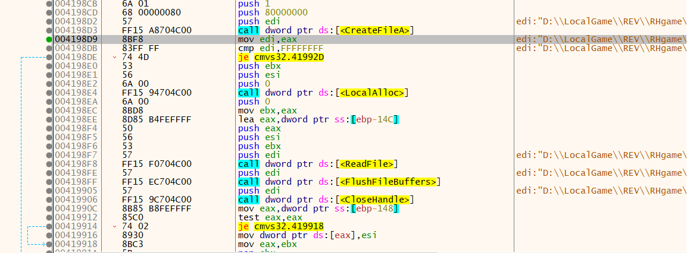 
你看看它在干什么？标黄的地方：
分配内存
读取文件
这是在干嘛？当然是把start.ps3载入到内存，所以我们赶紧下断点，开始单步跟踪（步过）；
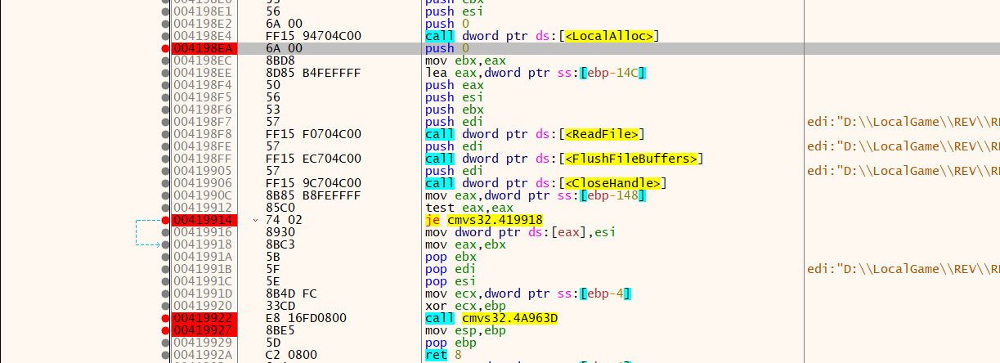 
OK，我们在步过到readfile后面的时候，发现提示（dbg提示你ebx中的地址指向一块以“PS2A0”字符串开头的地址）出现了这些PS2A0，你想到了什么？这不就是我们前面看过的的start.ps3嘛，现在它进内存了，我们赶紧dump（*这个词后面解释）住它，看看它在内存的哪里：  
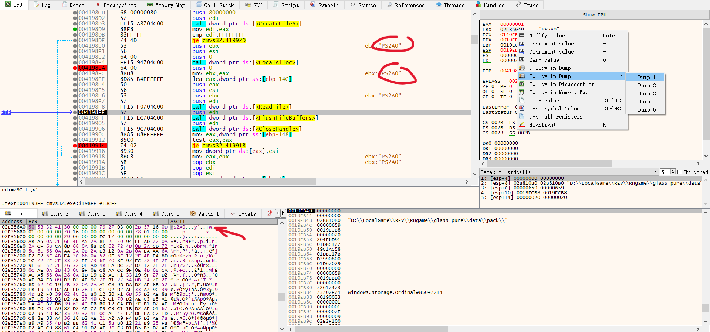  
继续跟踪，我们ret回到了调用处的上层：  
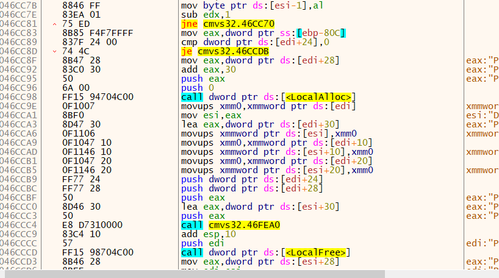   
继续单步，发现程序在这个地方面写了有些什么东西，反复的读写一个内存区段，dump它在写的内存的地方过去看下：  
发现他在这个内存的这个地区（其实就在文件头下一点）搞了一堆看不懂的什么东西（可能是密钥之类的？瞎猜的），不管它记住这个位置动了，打个断点先跳出来继续走：  
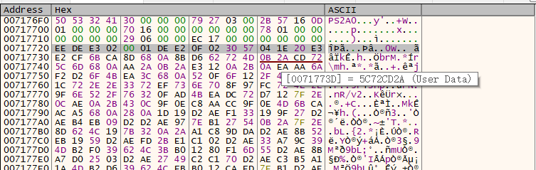 
跟到后面发现一个大localAlloc分配内存，这个时候你分配内存，你觉的它想干嘛？是个人都猜出来了它要为解密后的start.ps3分配内存：
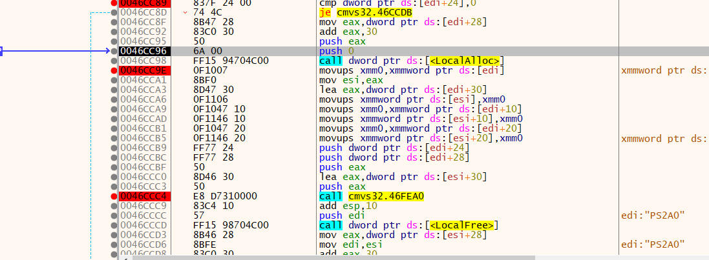 
call cmvs32.46fea0 这条过完再dump过去看看：
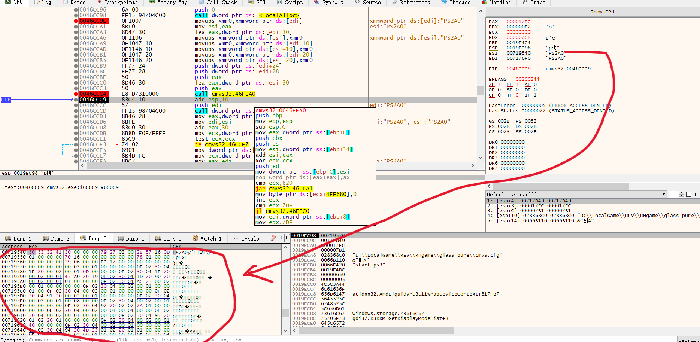 
是不是发现这个：PS2A0非常的“稀疏”，是不是和garbro中解密出来的.ps3文件文件很像,这是典型的明文机器码。那么按惯例.ps3文件后面应该跟着一些明文字符串，我们拉到后面看看：
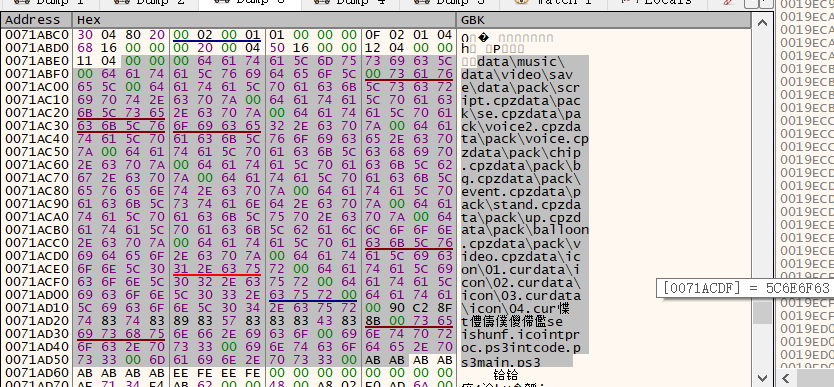 
一堆路径，指向我们的封包文件。
你猜这些路径是做什么用的？
没错，导入封包的。

那么，我们现在产生了一个大胆的想法，如果把script.cpz文件改成指向没有封包的文件夹路径，然后再修改exe跳过.ps3的解密过程，我们是不是就可以免封包解密script了？

## L19
好，我们先把解密后的start.ps3 dump出来，然后暂停调试：  
点击plugin > scylla > file > dump memory
填写起始地址和dump长度：  
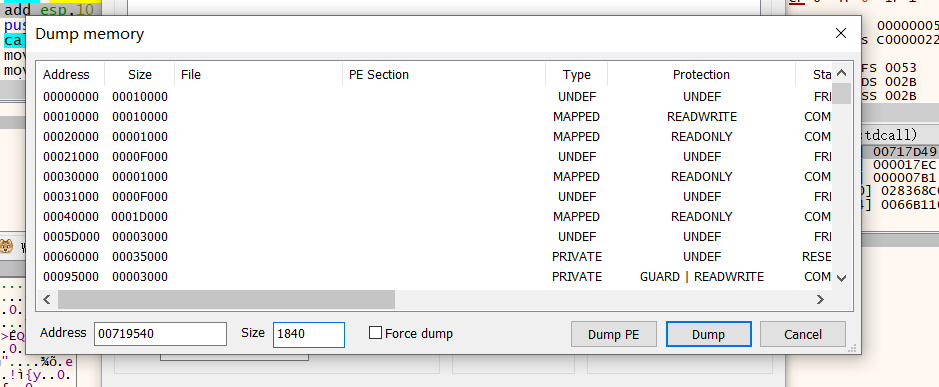   
这个就是解密后的start.ps3了，hex打开看一下：  
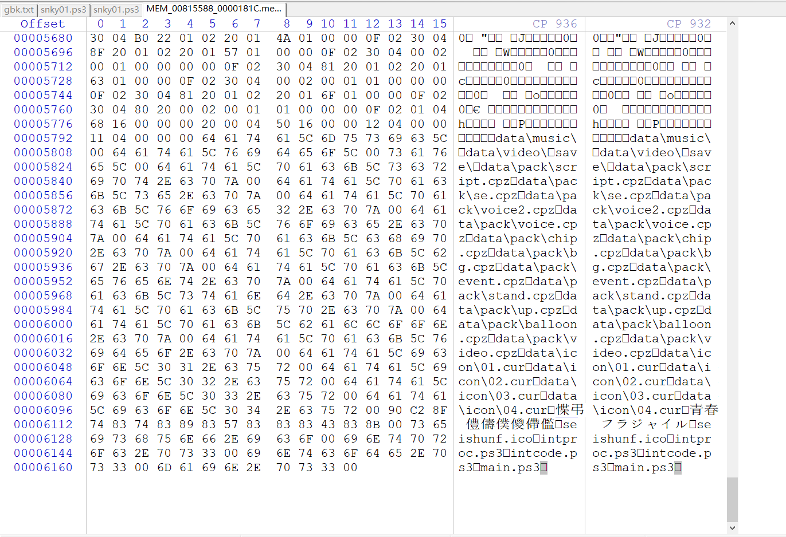   
这个是脚本cpz载入的路径，我们把它改成我们解包出来的路径  
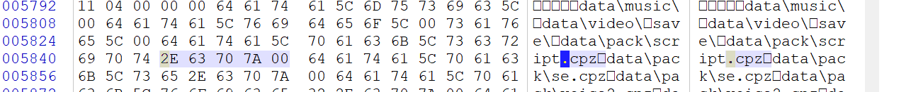 
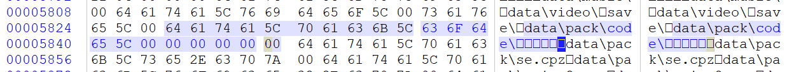   
然后把它替换掉原来的start.ps3,这样就可以了
为什么可以这样改？你看我标记的位置：  
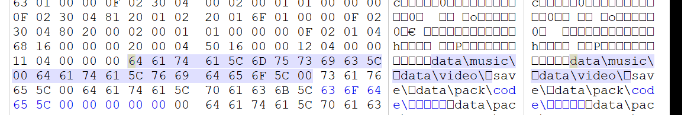   
这个video文件夹它自己就是这么导入的，说明这个系统有这样full load的能力嘛，反正逆向都是猜我们都是猜试试又不花钱。  
然后把解密后的start.ps3覆盖原来的文件，把script.cpz解包到pack\code  
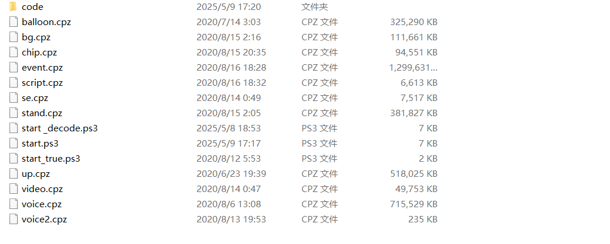 
然后我们开始修改exe来了实现跳过.ps3加密：  
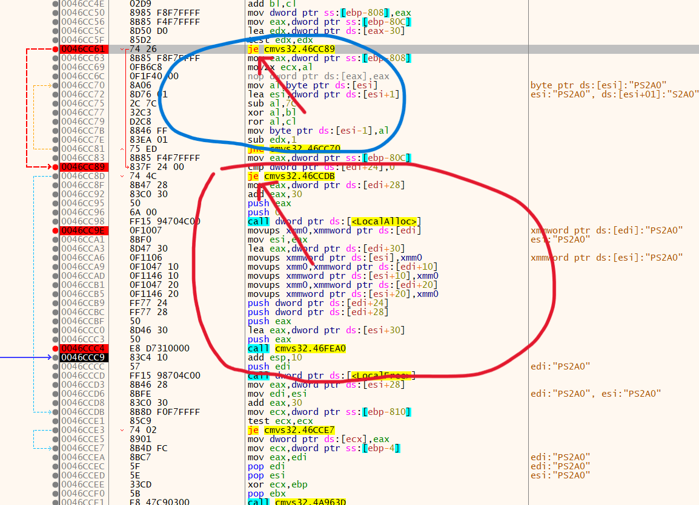  
我们来分析这些代码，算了我直接告诉你吧，蓝圈部分是生成密钥部分，红圈是用密钥解密和生成明文部分，
并且所有ps3解密逻辑都是走这里的，我们把两处je改成jmp，按空格：
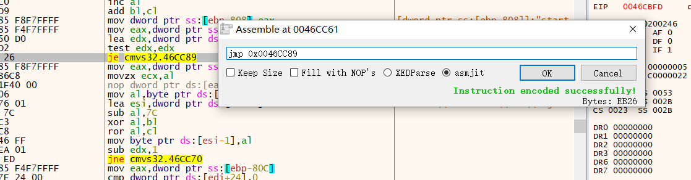 
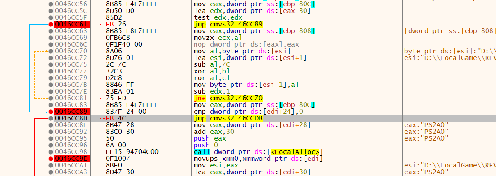 
点击创可贴，patch file > 选择原文件exe，保存为修改后的的exe。
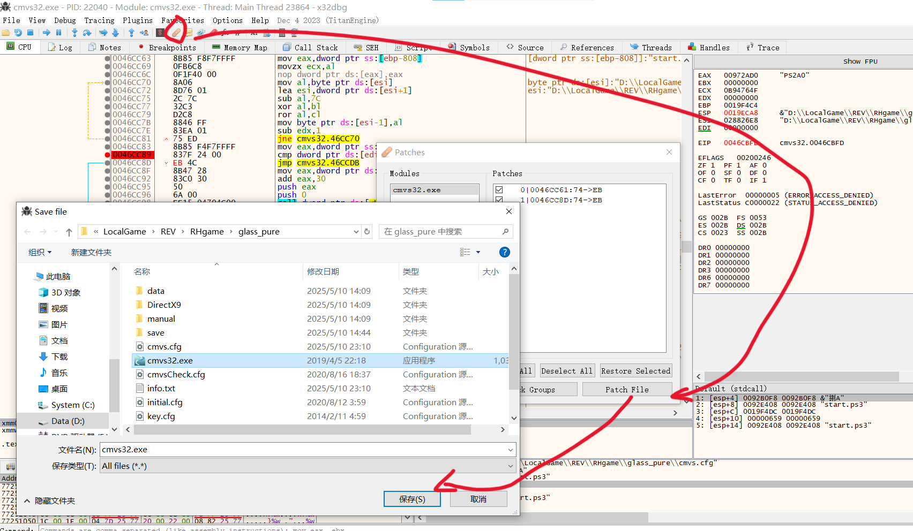 
发现可以正常打开游戏，至此，汉化完成了一半，我们已经完成了免封包，可以在明文的snkyxx.ps3文件中随意修改文本了。
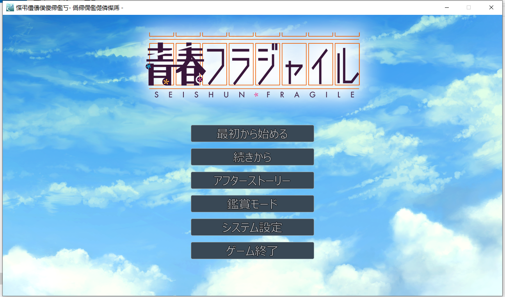 


## L20
接下来开始尝试汉化一些文本,后面的部分就是一些非常容易的固定的把式套路了（但也很重要！），没有需要分析的地方。  
前面我们提到，由于shift-jis不支持大部分汉字的显示，所以我们使用GBK编码来编写一些汉化文本，这里修改snky01.ps3：  
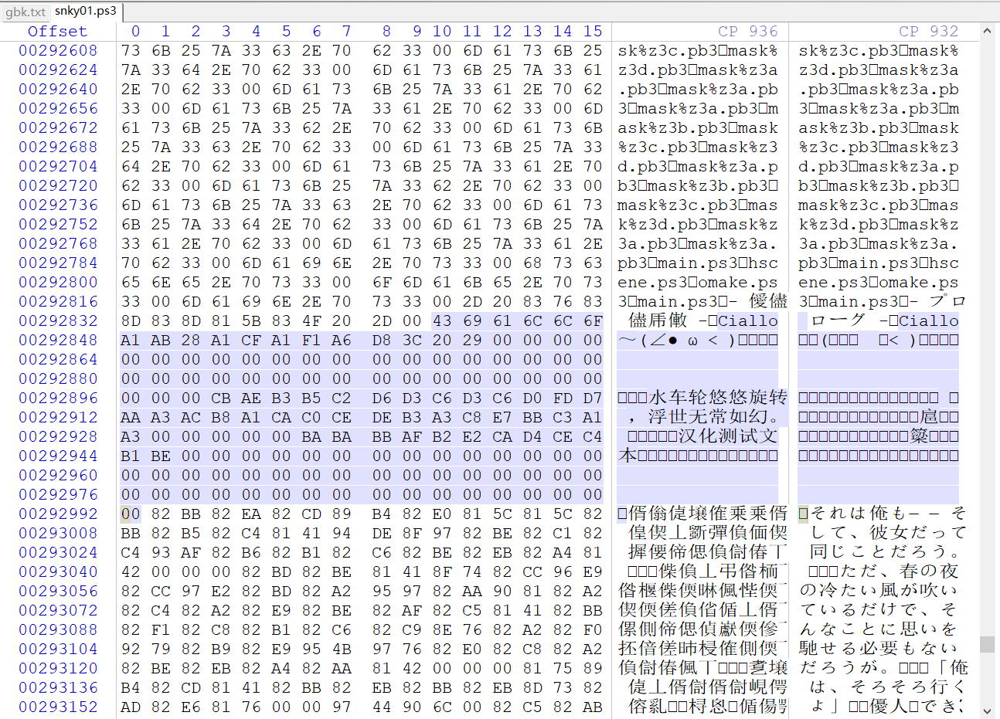   
注意这里的汉化文本要比原文短，这一般是可以做到的，因为中文的平均信息熵高，如果长度超过的话，要修改机器码来重新校验长度，需要一点计算和操作，要尽量避免。  
进游戏看看：  
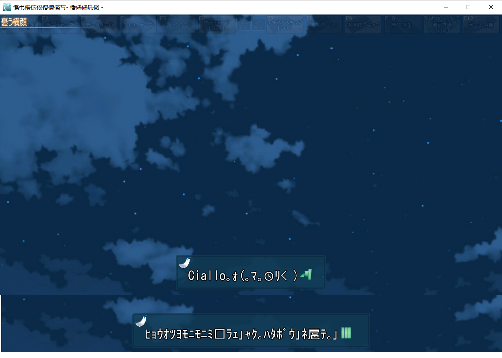   
发现文本已经改变，但是除了兼容的英文，其他的符号和汉字都是乱码。  
原因很简单，前面已经分析过，这是由于用jis的解码格式解GBK编码导致的。  
要修正很简单，再主模块cmvs搜索：createfont（这是一个非常常用的图像渲染win api，请熟记！）并打上断点：  
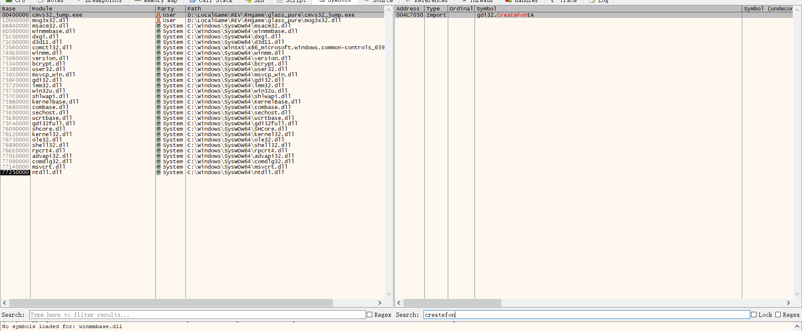   
进入游戏后停在createfonta内部，这时候按enter回到调用fonta的地方：  
【图片72】  
看到红圈圈出的地方了吗？这是典型的CreateFontA结构，push就是传递参数，push 0x80,push 0x00...这些相当于
CreateFontA(0,0,0,0,0,0,0x80,...)
这是CreateFontA完整的函数签名：
```C
HFONT CreateFontA(
  int    cHeight,           // 字体高度
  int    cWidth,            // 字体宽度
  int    cEscapement,       // 文本行倾斜角度
  int    cOrientation,      // 字符倾斜角度
  int    cWeight,           // 字体粗细
  DWORD  bItalic,           // 是否斜体
  DWORD  bUnderline,        // 是否下划线
  DWORD  bStrikeOut,        // 是否删除线
  DWORD  iCharSet,          // 字符集
  DWORD  iOutPrecision,     // 输出精度
  DWORD  iClipPrecision,    // 裁剪精度
  DWORD  iQuality,          // 渲染质量
  DWORD  iPitchAndFamily,   // 字体系列
  LPCSTR pszFaceName        // 字体名称
);
```
那么我们要改的是哪部分呢？就是push 0x80部分。 
 0x80这个常数是硬编码在gdi32中的一个数字，这是shift-jis的编号，而我们的gbk对应的编号是0x86，我们按空格把80->86即可。  

这边再看一眼蓝圈圈住的部分，这个就是就是一个栈帧，一个栈帧就代表一次函数调用，在x64dbg中会用一个一个黑色的线夹住，顶部的叫esp，底部的叫ebp，中间包裹的都是函数的参数，比如我蓝色箭头指向的就是前面传入的0x80参数。  
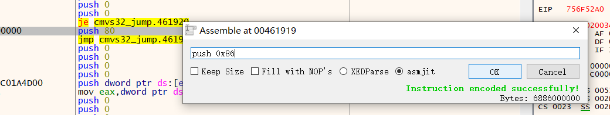   
像这样重复多改几次，因为游戏中不止一处调用CreateFontA，历史对话等等都要调用，都是一样的操作，反正记住都改80-86就好。  
然后改完后再进入游戏，发现还是显示不对：  
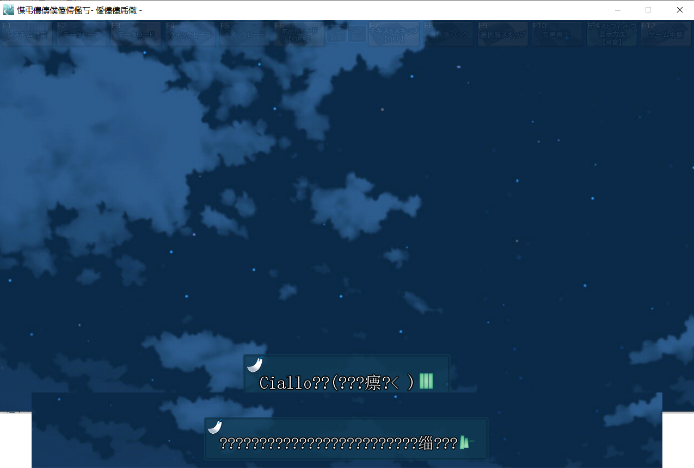     
这是为什么呢？  

## L21
你或许已经观察到，第二次显示有很多？？？？，而不像第一次那么多乱码
原因在于编码校验范围出错。
什么是编码校验范围？就是编码的边界。
因为shift-jis不会使用所有编码，  

只会使用0x81-0x9F | 0xE0-0xEF（第一字节） + 0x40-0x7E | 0x80-0xFC（第二字节）这两个范围的字符。  
而GBK使用：0x81-0xFE（第一字节） + 0x40-0x7E | 0x80-0xFE（第二字节）  
如果你是你会怎么写逻辑校验jis？  
是不是会写
```C
if((ch > 0x81 & ch < 0x9F) || (ch > 0xE0 & ch < 0xEF)){
    render(...);
}
else{
    render_default(); //如果走这个逻辑，就会渲染出默认替换字符□/?/� 
}
```
你想走第一个逻辑，是不是把9F->FE就行了？  
不管是shift-jis,还是jis0208这个编码，你只要知道这个道理就都随便改了。  
所以我们在主模块查找9F这个常量，断一下有跑到的地方直接改就可以了FE就可以了  
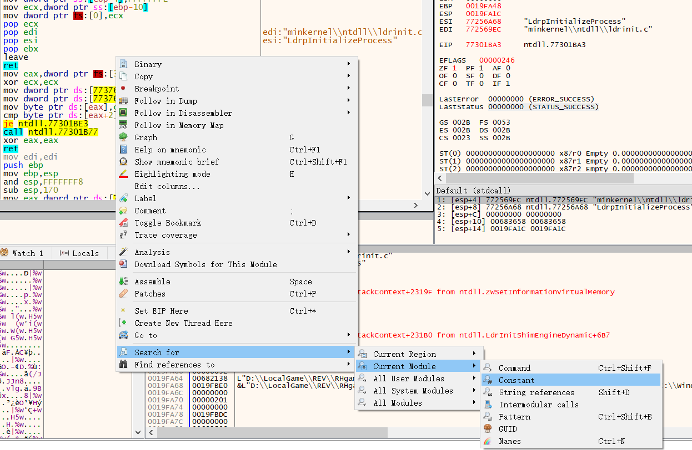     
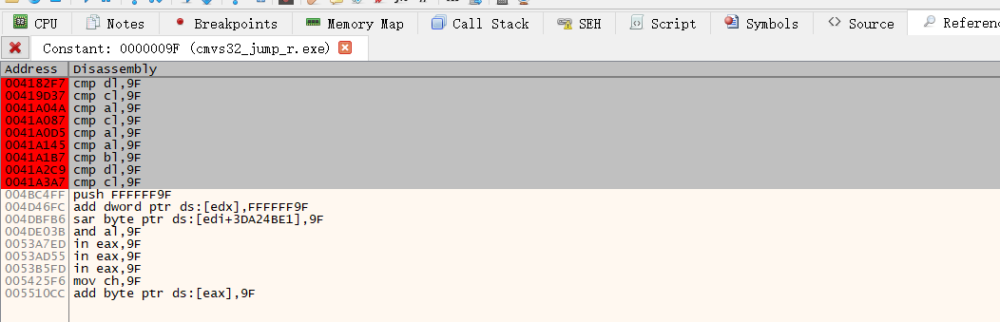     
改完之后再进游戏：  
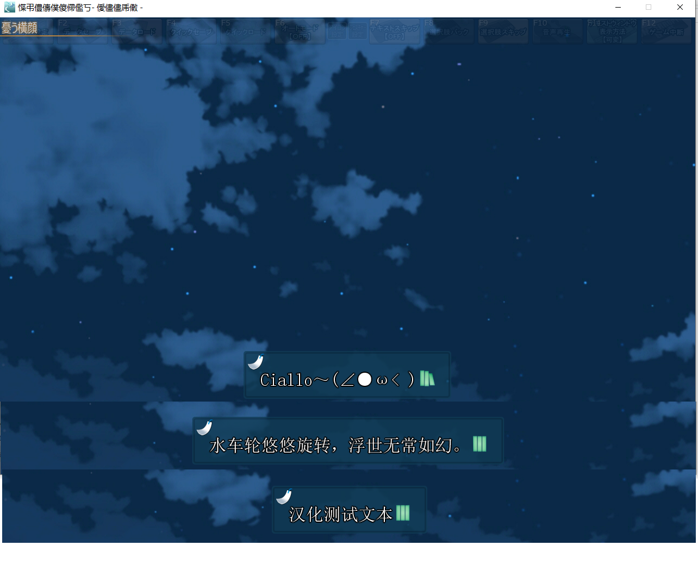     
文本汉化成功。 

# L22
其实到了这里，如果是自己玩的话，你已经可以宣称自己（在程序上）焊下这部作品了。  
但是如果是正经汉化，或者说你那天成为某个组的主程，你不可以只焊一个文本就说自己汉化成功了，这不行，也不对。  

需要特别申明：替换图片，UI，字体这些步骤都是【必不可少】的，甚至还有游戏中的部分演出，也有可能不走Textbox的逻辑，这些都是边测试边去修改的。 

当然你如果说这游戏太贼混淆手段太多，弄个文本就弄没半条命了，直接就这样也不失为一种选择。 

然后也是类似的思路把图片给替换：  
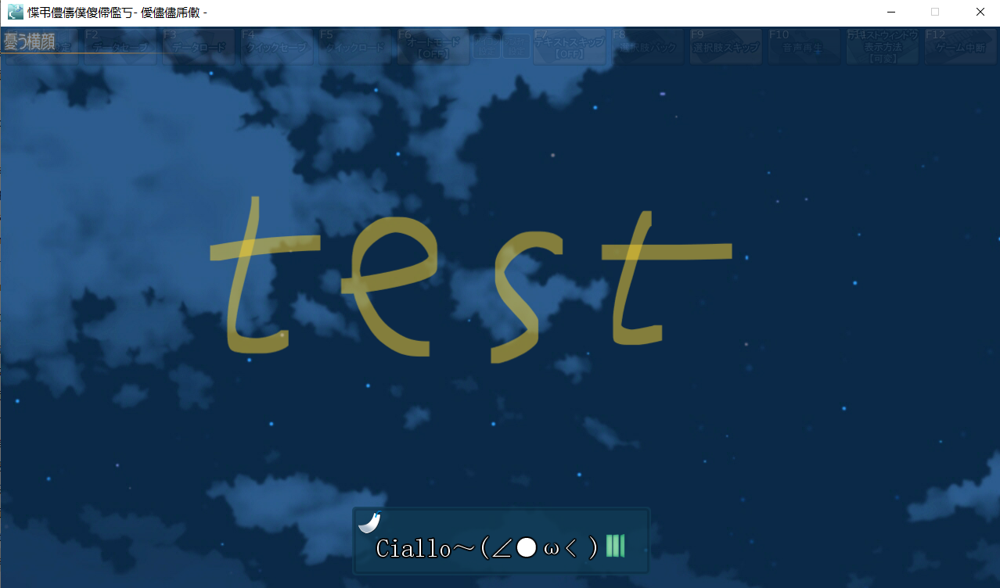     
替换图片这步不比替换文本来的简单，一样要分析不少东西。  
我自己是以及做过的，但是这篇帖子已经太长，迄止1.5w字，但我想我要介绍的东西：汉化基本流程，工具链，调试器的使用，基本跟踪技巧，以及一些必要的常识到这里也都介绍的差不多了，想必你要汉化的也不太可能是这部游戏，所以我就略过这步，到此为止。 
后面也还有一些程序要做的杂活，比如把文本提取出来，你用正则也好，还是什么其他手段，把文本弄成json之类的格式拿去焊就行了，这个非常简单，应该不用展示吧？
应该不用。
大概。  
概。  
好吧，还是展示一下，  
就是大概写这么一个脚本，把文本中的分隔符or机器码洗干净，处理成一个json：  
```python
import json

def process_binary_file():
    with open('in', 'rb') as f:
        data = f.read()

    # 查找所有分隔符位置
    separators = []
    i = 0
    n = len(data)
    while i < n:
        if data[i] == 0x00:
            # 检查是否是三个连续的00
            if i + 2 < n and data[i+1] == 0x00 and data[i+2] == 0x00:
                separators.append((i, i+2))
                i += 3
            else:
                separators.append((i, i))
                i += 1
        else:
            i += 1

    # 分割数据块
    blocks = []
    prev_end = 0
    for start, end in separators:
        block = data[prev_end:start]
        if block:
            blocks.append(block)
        prev_end = end + 1

    # 处理最后的分隔符后的数据
    final_block = data[prev_end:]
    if final_block:
        blocks.append(final_block)

    # 转换编码并生成结果
    result = {}
    for idx, block in enumerate(blocks, 1):
        try:
            decoded_str = block.decode('shift_jis')
        except UnicodeDecodeError:
            decoded_str = block.decode('shift_jis', errors='replace')
        
        result[str(idx)] = {
            "Byte": len(block),
            "str": decoded_str
        }

    # 保存为JSON文件
    with open('out.json', 'w', encoding='utf-8') as f:
        json.dump(result, f, ensure_ascii=False, indent=4)

if __name__ == "__main__":
    process_binary_file()
```
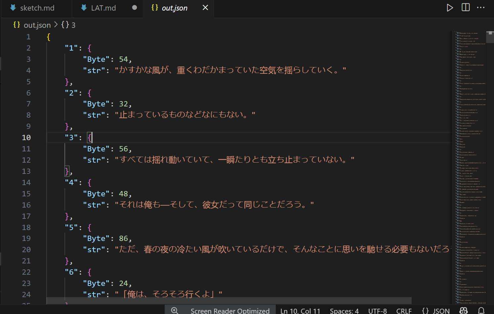   
大概就是这么一个效果，然后这些就随你拿捏了，处理完后同样写一个脚本拼回去就行。  
完。

## DLC
那么，那些日文要怎么处理呢？  
事先申明，步骤仅出于技术展示，没有含有任何唆教或鼓励或什么其他目的，你自己怎么弄是你的个人行为，弄出了事可万万不要把我给供出来，说是我教你怎么A翻怎么机的，没有啊都没有。  
首先我们需要一张4090。  
如果没有的话在autodl上创建一个账号，我们要租用算力来完成这件事，我的深度学习实验都是在这个平台上完成的。  
价格的话2-3/h，处理游戏文本几块就能搞定（由此观之，焊化十有八九还得倒贴钱，哈哈哈）。  
实例选择这个版本就行吗，注意一定要用4090，其他的卡不行：  
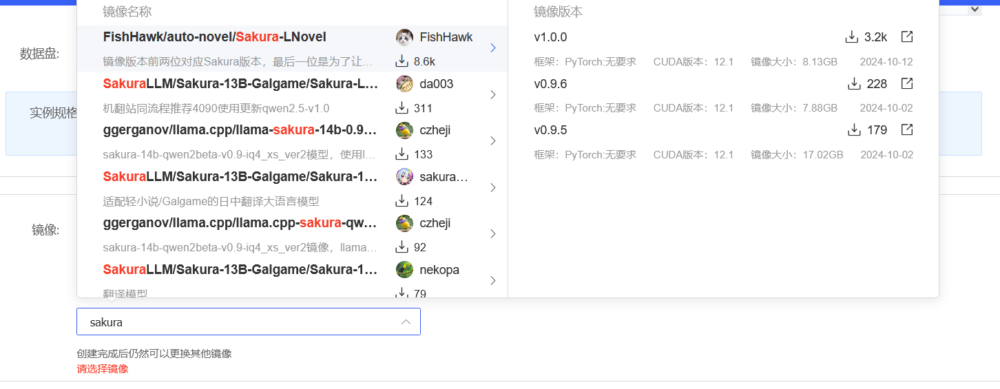     
介绍一下SakuraLLM：  
这是一个基于Qwen-7B大模型微调后的一个gal特化模型，由更上层Gal批制作。  
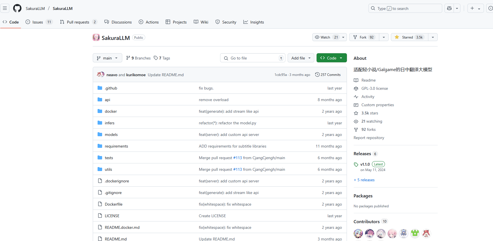     
具体使用文档在这里，已经讲的很清楚了，我就不赘述了：  
https://books.fishhawk.top/forum/65719bf16843e12bd3a4dc98  
反正你只要了解【jupyter】+ 【ssh】这个应该是没有什么门槛的。  
在pwoershell上键入形如，建立一个ssh转发server：  
ssh -N -L 6006:127.0.0.1:6006 -p 23xx2 root@connect.nxx1.seexxcloud.com
ssh密码手动输入，不可粘贴：  
  
然后就可以在6006端口访问到LLM了  
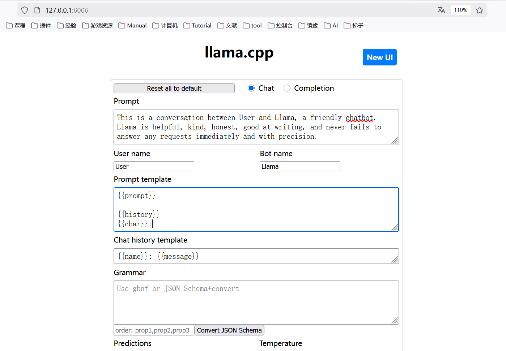   
然后就是刚才给你做的json处理成这种prompt模块，当成参数传给大模型，然后就...  
就...就自己熟悉一下吧，要自己动手的到这步肯定也不用我说接下来怎么弄了，我主要还是提示一下有这么个东西，平一下信息差。  
Fin.  
